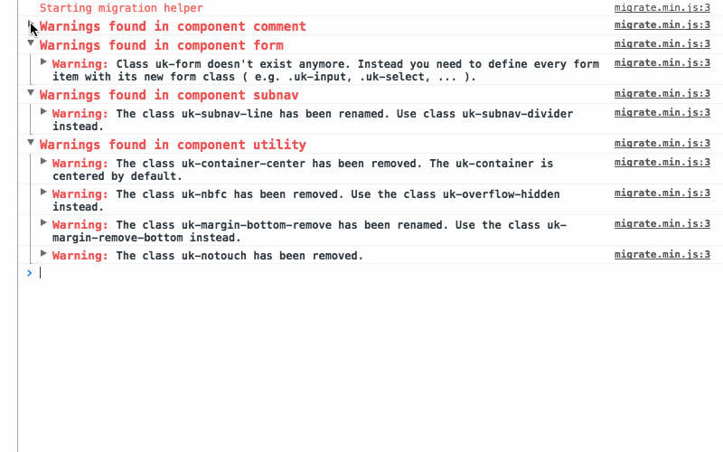

# Migration

<p class="uk-text-lead">Migrate an existing UIkit website to the latest version.</p>

***

## Migration from UIkit 3.2 to 3.3

UIkit 3.3 adds a new `uk-container-xlarge` class to the [Container component](container) with a width of `1600px` as default value. This is why the class `uk-container-large` changes its width from `1600px` to `1400px`. Update your markup by replacing the following classes.

| Class                | Replace with          |
| -------------------- | --------------------- |
| `uk-container-large` | `uk-container-xlarge` |


## Migration from UIkit 3.1 to 3.2

### Text Component

Since UIkit 3.2 adds a new `uk-text-bolder` class to the [Text component](text), the class `uk-text-bold` now applies literally a `bold` font weight instead of `bolder`. The `@text-bold-font-weight` variable, which was set to `bolder`, got removed.

***

## Migration from UIkit 3.0 to 3.1

UIkit 3.1 adds the `@deprecated` Less variable. By default, it is set to `false`, and deprecated classes are not compiled into the CSS. 

If you want to update your markup later and use the deprecated classes along the new ones, set the variable to `true` in your custom UIkit theme.

```
@deprecated: true;
```

### Heading Component

The Primary and Hero classes in the [Heading component](heading) are deprecated. Update your markup by replacing the following classes.

| Class                | Replace with        |
| -------------------- | ------------------- |
| `uk-heading-primary` | `uk-heading-medium` |
| `uk-heading-hero`    | `uk-heading-xlarge` |

***

## Migration from UIkit 2 to 3

Uikit 3 offers a migration tool that runs in your browser and lists all necessary changes from an existing Uikit 2 site. Two options are available to run the tool: Via a bookmark or by including a single JavaScript file. The necessary migration changes are then listed in your browser's console.

### Browser bookmark

The easiest way to use the migration tool is via a bookmark in your browser. You can then run the script on any page that you navigate to by simply clicking the bookmark. Just drag the following link into your browser's bookmark section.

Drag into your bookmark bar <span uk-icon="icon: arrow-right"></span> <a class="uk-button uk-button-primary" href="javascript: (function () { var script = document.createElement('script'); script.setAttribute('src', 'https://getuikit.com/migrate.min.js'); document.body.appendChild(script); }());">UIkit 3 Migration</a>

Alternatively, you can manually create a bookmark with the following code as its URL.

```js
javascript: (function () {
    var script = document.createElement('script');
    script.setAttribute('src', 'https://getuikit.com/migrate.min.js');
    document.body.appendChild(script);
}());
```

### HTML integration

You can also run the migration tool by loading the needed JavaScript on your website. This way the migration script will always be loaded on your website. Remember to remove this when you have completed the migration. Add the following line just before the closing `</body>` tag.

```html
<script src="https://getuikit.com/migrate.min.js"></script>
```

### Usage

To start the migration, replace the UIkit 2 files of your website with their UIkit 3 equivalents (both JS and CSS) and run the migration tool using one of the solutions listed above. To learn how to change your markup, open the developer console of your browser. Your see a list of warnings and notices that tell you what to change. You can click the arrows next to any message to see more details about the necessary changes.



Every notice or warning message tells you what to change, including a list of all affected HTML elements. More complex changes are explained with examples that are easy to follow. The best way to migrate is to fix one component after another. That way you can see if the error messages are gone after a reload and also see the changes on your site.

### Warnings

Warnings highlight all CSS classes or JavaScript attributes which are not supported anymore or have changed in UIkit 3. These warnings have to be fixed to migrate your website to UIkit 3.

### Notices

Notices highlight potential issues that might not break your site. Some notices might not require a change at all. This is caused by the fact that some names from UIkit 2 still exist in UIkit 3, but now belong to a different component or carry different semantics. This can't be detected by the selectors we use to determine if this is a correct markup, so you need to take a look into it and need to decide if you already have changed it or still need to fix it.
